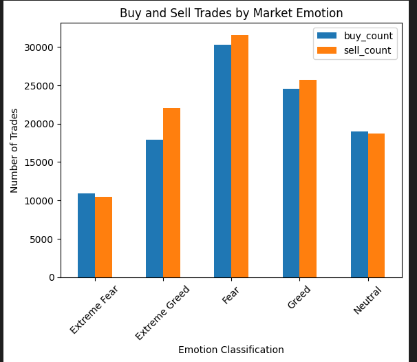
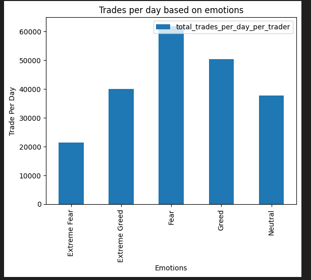
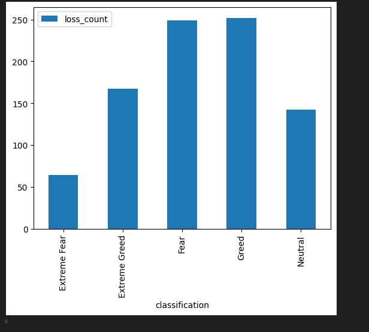

# trade-behaviour-insight

So for performing the above program you need to have install python
and python packages which you can install via these command
1.pip install pandas 
2.pip install numpy
3,pip install matplotlib

SO lets start the Explination of Trade-behavior Analysis 

Step 1:Import the dataset
in the first step i imported both 'fear_greed_index.csv' file
and 'historical_data.csv' file

Step 2:Preprocessing of the data 
So in this step you will make your data in a format so that we can use it for analysis

So here i identify the column which is very usefull for me that is 

1.Account and date through which i can get 'trader_per_day'

2.PnL through which i can get total number of profitable and loss trades in the day

3.I calculated buy and sell per day which will be very helpful classifying 
the buy and sell in each emotions such as greed ,fear,neutral etc

4.i dropped unnecessary column

5.i group by the data based on data and Account

6.Then joined the both data frame of 'fear_greed_index.csv' file
and 'historical_data.csv' file  using left outer join 

Step 3:Analysis
1.I plotted the graph of Emotions and buy and sell on that particular emotion

2.I plotted the graph of Emotions and total trade per day

3.I plotted the graph of number of losses and Emotions

=========conclusion=========

1.By the graph of Emotions and buy and sell on that particular emotion
i understand that during fear people are buying and selling the most 

2.By the graph of Emotions and total trade per day
i understand that during extreme greed people are doing least number of trades4

3.By the graph of number of losses and Emotions
i understand that losses during fear and greed is extremly high

